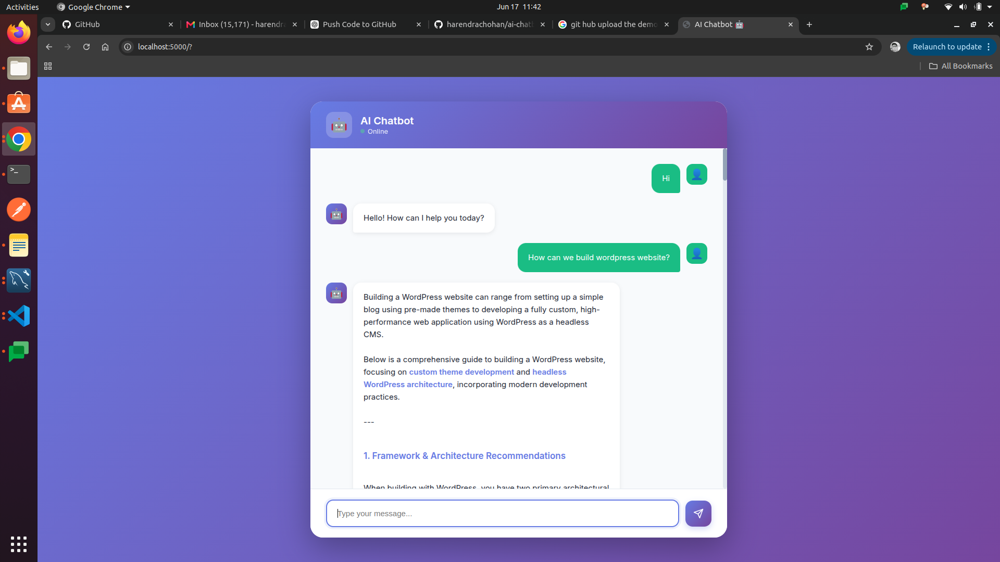

# 🤖 AI Chatbot

A simple AI-powered chatbot built for demonstration purposes. This project showcases how to integrate conversational AI into an application.

---

## 🚀 Features

* Interactive chatbot interface
* AI-based responses
* Easy to set up and run
* Lightweight demo project

---

## 📸 Demo



> Replace `demo.png` with your actual screenshot file in the project folder.

---

## 🛠️ Installation

Clone the repository:

```bash
git clone https://github.com/harendrachohan/ai-chatbot.git
cd ai-chatbot
```

Install dependencies:

```bash
npm install
```

---

## ▶️ Run the Project

Start the chatbot:

```bash
npm start
```

Or (if using nodemon):

```bash
npm run dev
```

---

## 📂 Project Structure

```
ai-chatbot/
│── node_modules/
│── src/
│── package.json
│── .gitignore
│── README.md
```

---

## ⚙️ Scripts

* `npm start` → Run the app
* `npm run dev` → Run in development mode
* `npm install` → Install dependencies

---

## 📌 Note

This project is created **just for demo purposes** and can be extended with advanced AI features, APIs, and UI improvements.

---

## 👨‍💻 Author

**Harendra Chauhan**

---

## ⭐ Contribute

Feel free to fork this repo and improve it!
